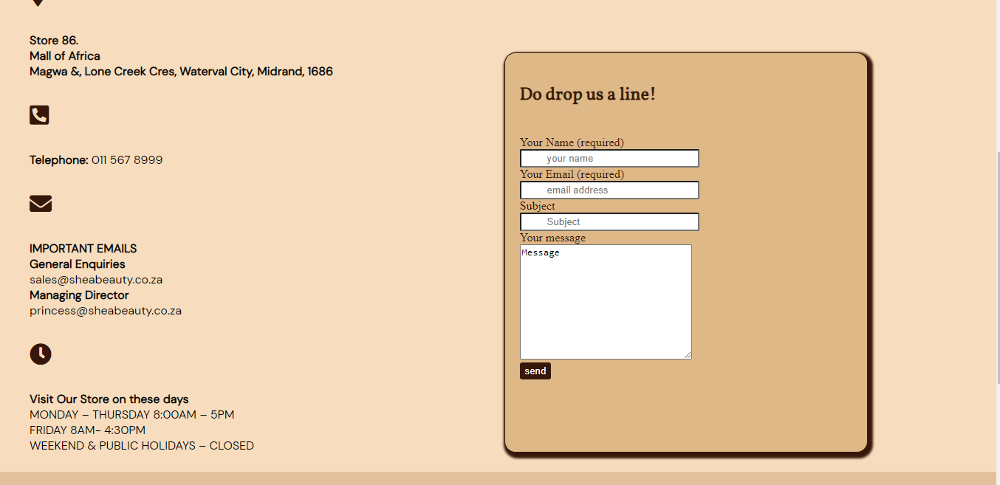

# Shea Beauty
> This a website for a company called shea beauty where they show the shea butter products that they have in their store. 
> Live demo [_here_](https://nolitha-princess.github.io/shea-beauty/). <!-- If you have the project hosted somewhere, include the link here. -->

## Table of Contents
* [Index](index.html)
* [Products](products.html)
* [About Us](about.html)
* [Contact](contact.html)
* [Oils](oils.html)
* [Skin](skin.html)
* [Hair](hair.html)
* [Butter Tubs](tubs.html)

## General Information
- This a website for shea beauty.
- This website will prevent customers going to the shop not knowing what products they will want to buy. It also gives them the opportunity to know more about it 
as they can research the product before going to buy it.
- This website allows the customers of the shop to view and see what is instore and can also press a wishlist button to let the shop know what they 
are interested in buying so that the shop can stock.
- This was our first website attempt exercise for girlcode learnership programme.

## Languages Used
- HTML
- CSS
- Javascript

## Features
List the ready features here:
- Get important information related to company 
- View products instore
- Send a form to company to be contacted

## Screenshots
  

## Project Status
Project is: _no longer being worked on_. The exercise has been submitted for evaluation.

## Room for Improvement

Room for improvement:
- The wishlist button can work and actually give information to the shop and show what the customers have put in their wishlist.
- The website can have an instore cart which notifies the shop of what someone wants and they can just get in shop and pick it up and pay without wasting time.

## Acknowledgements
- Created by Nolitha Magagula
- This project was inspired by my interest in shea butter and love for what it does for the skin and hair.

## Contact
Created by [Nolitha Magagula](nolithaprincess@gmail.com)

